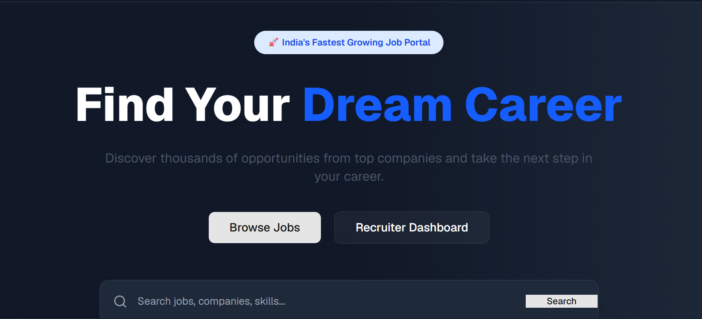
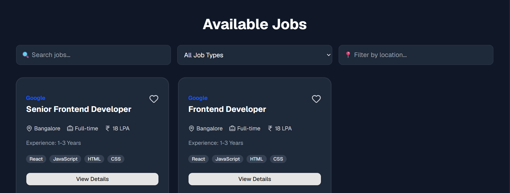
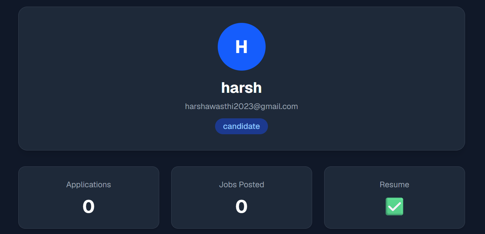

# 💼 Job Portal

A modern Full Stack Job Portal built using React, Node.js, Express, and TiDB Cloud. Users can register, login, browse jobs, and apply for positions through a responsive web interface.

## 🌐 Live Demo

Frontend:
https://job-portal-drab-xi.vercel.app

Backend API:
https://job-portal-backend-76ad.onrender.com

---

## 🚀 Features

- User Authentication (JWT)
- Register & Login
- Browse Jobs
- Apply for Jobs
- Recruiter Dashboard
- Candidate Profile
- Resume Upload
- Secure Password Hashing
- Responsive UI
- REST API
- Cloud Database
- Automatic Deployment

---

## 🛠 Tech Stack

### Frontend

- React
- Vite
- Tailwind CSS
- Axios
- React Router

### Backend

- Node.js
- Express.js
- JWT
- bcrypt
- Multer

### Database

- TiDB Cloud (MySQL Compatible)

### Deployment

- Vercel
- Render
- GitHub

---

## 📷 Screenshots

### Home Page



### Jobs



### Profile



---

## 📂 Project Structure

```
Job-portal
│
├── frontend
│   ├── src
│   ├── public
│   └── package.json
│
├── backend
│   ├── config
│   ├── controllers
│   ├── middleware
│   ├── routes
│   ├── uploads
│   └── server.js
│
└── README.md
```

---

## ⚙ Installation

Clone the repository

```bash
git clone https://github.com/HarshAwasth-i/Job-portal.git
```

Install frontend

```bash
cd frontend
npm install
npm run dev
```

Install backend

```bash
cd backend
npm install
npm start
```

---

## 🔑 Environment Variables

Backend

```
DB_HOST=
DB_PORT=
DB_USER=
DB_PASSWORD=
DB_NAME=

JWT_SECRET=
PORT=
```

Frontend

```
VITE_API_URL=
```

---

## Future Improvements

- Job Search Filters
- Email Notifications
- Saved Jobs
- Admin Dashboard
- Chat System
- Company Profiles

---

## 👨‍💻 Author

**Harsh Awasthi**

GitHub:
https://github.com/HarshAwasth-i

