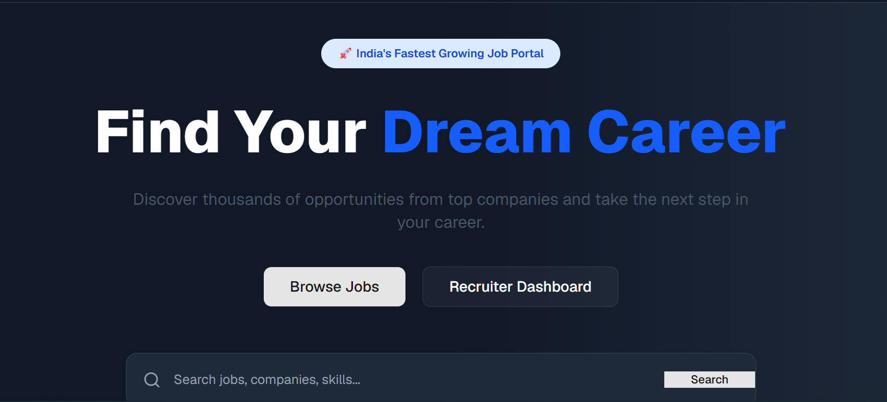
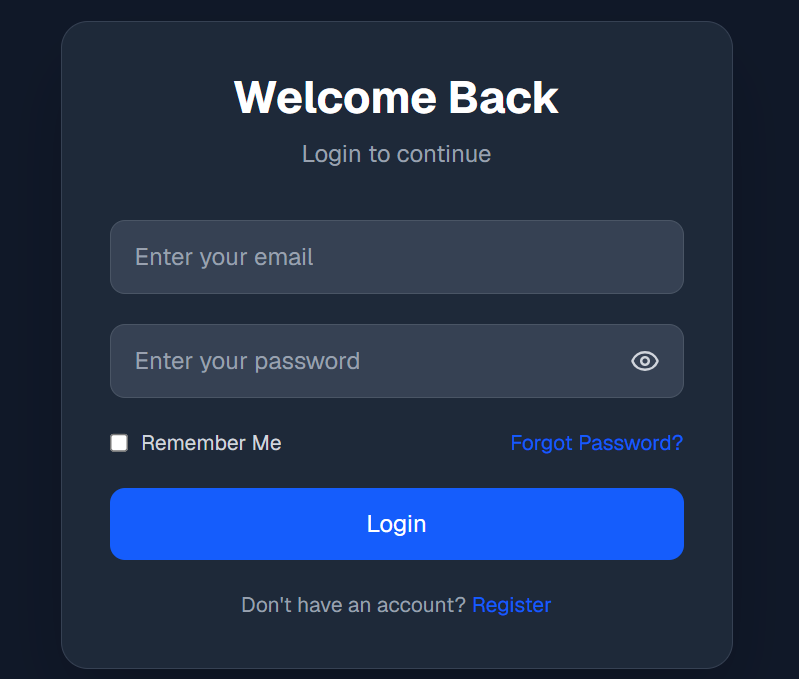
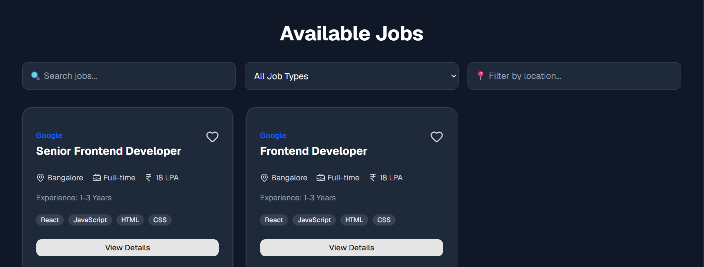

# 💼 Job Portal

<div align="center">


### A Modern Full-Stack Job Portal Platform

Search jobs, apply for opportunities, manage applications, and connect recruiters with job seekers through an intuitive web application.

### 🌐 Live Demo

Frontend:
https://job-portal-drab-xi.vercel.app

Backend API:
https://job-portal-backend-76ad.onrender.com

</div>

---

# 📖 Overview

Job Portal is a full-stack recruitment platform that connects job seekers with recruiters.

The platform enables users to browse job listings, search by keywords, apply for jobs, manage applications, and allows recruiters to post and manage job openings.

Built using React for the frontend, Express.js for the backend, MySQL for database management, and JWT Authentication for secure user access.

---

# ✨ Features

### 🔐 Authentication

- User Registration
- Secure Login
- JWT Authentication
- Protected Routes

### 💼 Job Listings

- Browse Available Jobs
- Search Jobs
- Filter by Category
- View Job Details

### 📝 Job Applications

- Apply for Jobs
- Track Applied Jobs
- Manage Applications

### 🏢 Recruiter Dashboard

- Post New Jobs
- Edit Job Listings
- Delete Job Posts
- Manage Applicants

### 👤 User Dashboard

- View Profile
- Update Personal Information
- Application History

### 🔍 Search & Filters

- Search by Job Title
- Filter by Company
- Filter by Location
- Easy Navigation

### 🌙 User Experience

- Responsive Design
- Beautiful UI
- Fast Navigation
- Toast Notifications

---

# 🛠 Tech Stack

## Frontend

- React
- Vite
- Tailwind CSS
- React Router
- Axios

---

## Backend

- Node.js
- Express.js
- JWT Authentication
- bcrypt.js
- REST API

---

## Database

- MySQL

---

## Deployment

| Service | Platform |
|----------|----------|
| Frontend | Vercel |
| Backend | Render |
| Database | MySQL |

---

# 📸 Application Screenshots

## 🏠 Home Page

<p align="center">
  
</p>

---

## 🔐 Login Page

<p align="center">
  
</p>

---

## 💼 Jobs Page

<p align="center">
  
</p>

---

## 📄 Job Details

<p align="center">
  
</p>

---

## 👤 Dashboard

<p align="center">
  
</p>

---

# 📂 Project Structure

```text
Job-Portal
│
├── client
│   ├── src
│   ├── public
│   └── package.json
│
├── server
│   ├── controllers
│   ├── middleware
│   ├── routes
│   ├── config
│   └── server.js
│
└── README.md
```

---

# ⚙ Installation

## Clone Repository

```bash
git clone https://github.com/HarshAwasth-i/Job-Portal.git
```

Move into the project

```bash
cd Job-Portal
```

---

## Frontend

```bash
cd client
npm install
npm run dev
```

---

## Backend

```bash
cd server
npm install
npm start
```

---

## Environment Variables

Create a `.env` file inside the **server** folder.

```env
PORT=5000

DB_HOST=localhost
DB_PORT=3306
DB_USER=your_username
DB_PASSWORD=your_password
DB_NAME=job_portal

JWT_SECRET=your_secret_key
```

---

# 🚀 Future Improvements

- Resume Upload
- Company Profiles
- Saved Jobs
- Email Notifications
- AI Job Recommendations
- Resume Matching
- Admin Dashboard
- Interview Scheduling

---

# 📈 Learning Outcomes

Through this project, I gained practical experience in:

- Full-Stack Web Development
- REST API Development
- JWT Authentication
- MySQL Database Design
- CRUD Operations
- React Routing
- Backend Integration
- Responsive UI Design
- Git & GitHub Workflow
- Deployment using Vercel & Render

---

# 👨‍💻 Author

**Harsh Awasthi**

GitHub:
https://github.com/HarshAwasth-i

LinkedIn:
https://www.linkedin.com/in/harsh-awasthi-181761331/

---

<div align="center">

Made with ❤️ using React, Node.js, Express & MySQL

</div>
